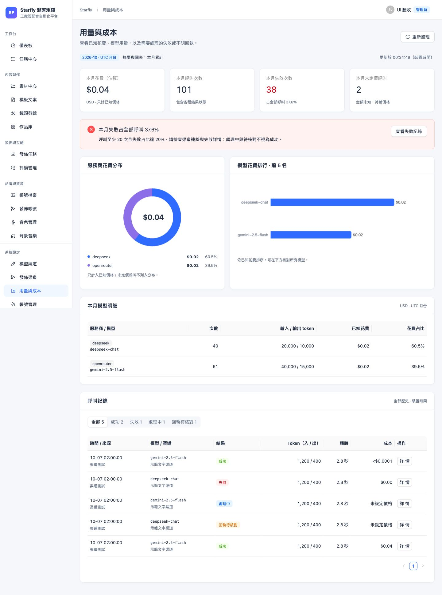
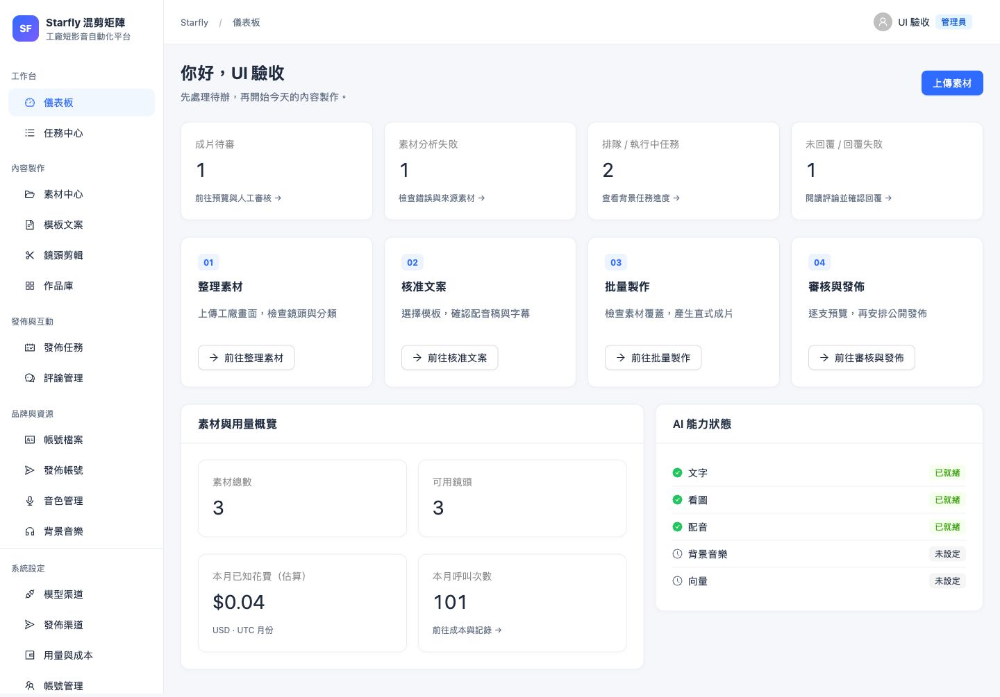
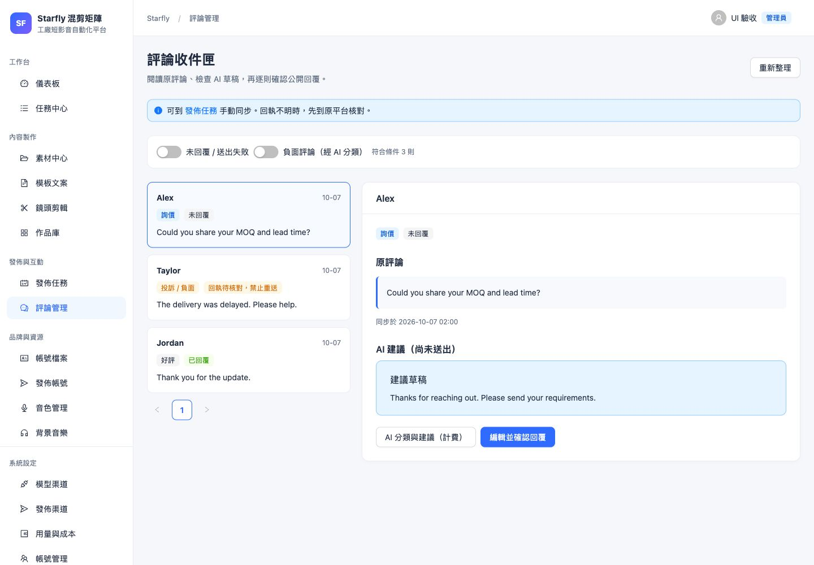

# Starfly 全站 UI 升級（EIL-79）

日期：2026-10-07。使用者已核准第一輪方案，程式與本機驗證完成；正式部署與真實操作待驗收。基線為 `bab351e`，分支為 `codex/eil-79-ui-upgrade`。追蹤：[EIL-79](https://linear.app/eilveiaan/issue/EIL-79/依核准方案升級-starfly-全站-ui)。

## 交付內容

沿用 Ant Design，統一淺灰背景、白色內容、藍色主操作、數字對齊、鍵盤焦點、手機操作區與持續顯示的資料讀取錯誤。導覽依工作台、內容製作、發佈與互動、品牌與資源、系統設定分組；拍攝員仍只可用儀表板與素材中心。

| 頁面 | 升級結果 |
| --- | --- |
| 儀表板 | 移除寫死的開發進度，使用既有 API 的待審、分析失敗、排隊／執行中、未回覆／送出失敗數量；可直接前往工作 |
| 用量與成本 | UTC 本月 KPI、已知成本服務商分布、模型排名、完整模型與呼叫明細；四種全部歷史狀態數量各用 `limit=1` 查詢，與月摘要一起刷新 |
| 素材與文案 | 可展開上傳佇列、目前篩選提示、錯誤／重試；模板與審核分階段、生成摘要、固定核准操作，付費配音試聽有文字提示 |
| 批量製作 | 選文案、素材覆蓋、音訊／字幕、批次摘要；保留原參數與預設值，進階原聲可收合，手機文案清單改為卡片 |
| 作品審核 | 待審為預設；放大詳情、原生 MP4 預覽、依實際時長排列的鏡頭條與跳段，手機底部通過／退回操作 |
| 任務、發佈與評論 | 狀態按鈕篩選、完整錯誤 Drawer、手機摘要卡；發佈前目的地／文字／時間摘要、評論列表與處理區、修改後重新人工確認 |
| 品牌、音訊與設定 | 整理表單分區、手機卡片、授權／檢查狀態、收合渠道細節；沿用已有樣本與配音快取，不因瀏覽或 hover 產生費用 |

新增 runtime 相依只有 `echarts`（及其傳遞相依），採按需引入並動態載入成本頁。沒有修改後端、資料表、業務端點、AI provider、租戶契約或部署腳本。

## 資料與操作契約

- 摘要與圖表為 UTC 本月，記錄為全部歷史，時間顯示採裝置時區；不把當頁記錄推算成全量統計。失敗占比以全部呼叫為分母，至少 20 次呼叫且失敗達 20% 才顯示高失敗警示；處理中與待核對不視為成功。
- 未定價呼叫沿用 API 定義。未知金額顯示「未設定價格」，真正零為 `$0.00`；正數小於 `$0.0001` 顯示 `<$0.0001`，詳情／Tooltip 提供原值。沒有已知花費時不畫圓環；讀取失敗不顯示零或正常。
- 發佈只能選同一帳號檔案的已通過成片。人工確認前不能排程，修改後清除確認；request key 與原有後端審核／冪等檢查保留。
- `uncertain`／處理中的發佈只核對原回執；草稿匣明示需人工完成。評論回執待核對時沒有公開重送入口；公開回覆仍帶原 version，修改文字後需重新確認。
- 鏡頭條僅預覽與定位，換素材仍走既有重新渲染／人工審核。第一輪沒有新增每日成本／同期比較 API、發佈日曆、全站品牌切換器、HTTPS 或可編輯多軌時間軸。

## 已完成驗證

| 檢查 | 結果與證據範圍 |
| --- | --- |
| 前端 | `npm run lint`、`npm test`（3 項）、`npm run build` 通過；成本測試包含 NULL／零／微額、全部呼叫分母、最小樣本警示 |
| 後端 | 隔離 PostgreSQL 與支援 libass 的 FFmpeg：完整 `python -m pytest -q`，162 項通過（123.46 秒） |
| 版面 | 16 個功能頁在 1440×1000、768×1024、390×844、320×800 檢查整頁寬度，沒有 body 橫向溢出；17 個頁面（含登入）有桌面／平板／手機前後截圖 |
| 成本 | 合成讀取失敗時 KPI 為「—」、無成本圖；只有未定價時不畫假圓環；微額 `$0.000023` 詳情讀回原值 |
| 確認與回執 | 發佈／回覆確認前停用、確認後可用、修改後再次停用；未知發佈只有查原回執，未知評論沒有回覆／AI 建議入口；沒有實際送出 |
| 主要操作 | 選文案後素材覆蓋與「1 份 × 2 支」摘要更新；合成提交讀回 `per_script=2`、`style=random`、`bgm=auto`、`bgm_volume=0.22`、`ambience=0`（端點回 409，不執行生成）；原生 15 秒合成 MP4 點鏡頭 3 後播放位置約 10.4 秒；鍵盤 Enter 可開啟完整任務錯誤 |
| 拍攝員 | 導覽只有儀表板／素材，直接開用量頁返回儀表板；觀察到的 API 只有 `auth/me` 與 `dashboard`，沒有管理員資料查詢 |

截圖均為本機合成資料，沒有正式帳號、Key、真實經營數據。UI fixture 禁止實際生成、發佈與回覆；測試資料與資料庫沒有加入倉庫。

手機製作與審核：[批量製作](ui-upgrade/editor-mobile.jpg)、[成片審核](ui-upgrade/review-mobile.jpg)；操作屏障：[發佈人工確認](ui-upgrade/publish-confirmation.jpg)。

## 限制與上線驗收

本機 Homebrew FFmpeg 沒有 ASS 字幕濾鏡，完整後端驗證使用既有隔離環境內含 libass 的 FFmpeg；應用相依與渲染邏輯未變。Starlette 有既有棄用警告；build 有 chunk 大小警告，成本圖 gzip 約 179 kB 且只在用量頁載入，主 bundle gzip 約 547 kB。這次沒有宣告網頁效能提升或完整無障礙符合性。

正式版仍須 PR／CI 通過、Ops `backup`、合併共用分支後部署、Ops `verify`，再讀回實際頁面。目前登入的 GitHub CLI 帳號對原倉庫沒有 push／merge 權限，透過 fork PR 交付；已確認先前的 Chrome 倉庫擁有者維運登入仍存在，可沿既有 UI 操作處理 CI 與 Ops，不擷取或轉移 cookie／token。

真實 tus 上傳／暫停／續傳、行動相機、付費文案／配音／音樂、換素材後重新渲染，以及平台排程／回覆沒有在本次合成 UI 驗收中執行。上線後沿既有授權範圍逐項驗收；沒有 Key／帳號或真實回執時保留未完成，不能以截圖、fixture 或 CI 代替真實結果。
